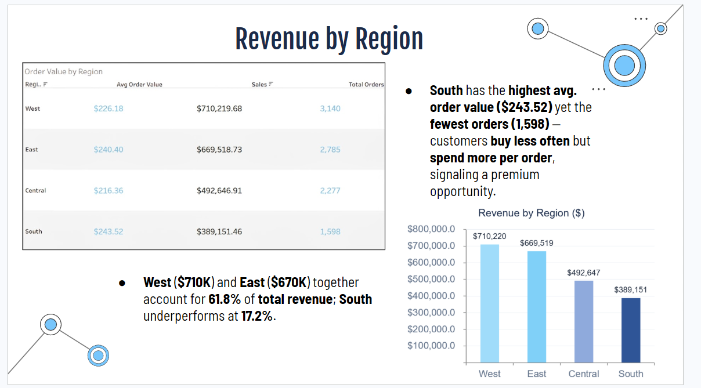
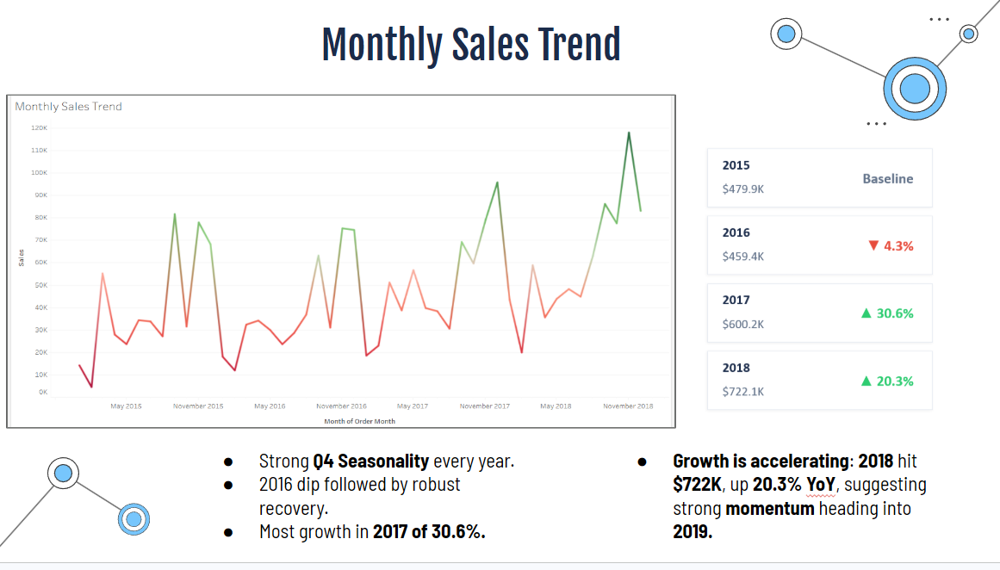
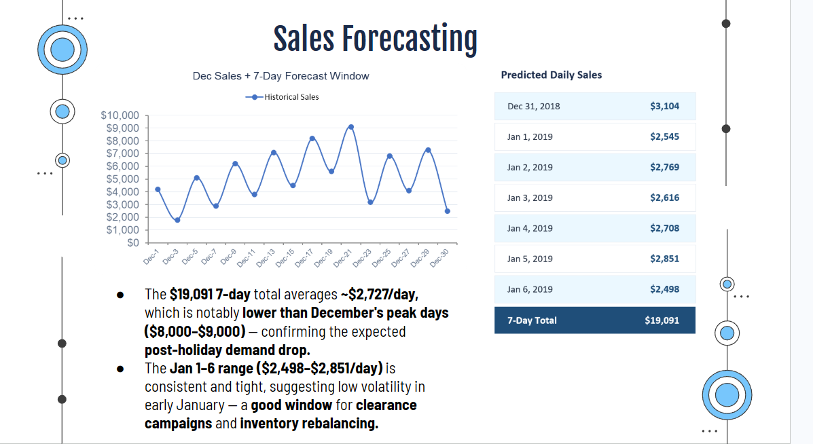

# Superstore Retail Sales Performance & Time-Series Demand Forecasting

An end-to-end corporate business analysis project transforming 4 years of siloed retail e-commerce transaction data into actionable supply chain, marketing, and inventory strategies.

---

## 1. Project Background & Business Case
In the global retail industry, supply chain inefficiencies are a massive driver of capital loss. Research indicates that roughly 30% of inventory across retail operations is either overstocked or understocked at any given time, resulting in severe holding costs and missed sales (McKinsey & Company)[cite: 2]. Conversely, data-driven supply organizations routinely achieve a 15% to 20% reduction in total inventory costs by applying predictive analytics (ThroughPut, 2025)[cite: 2].

This project shifts "Superstore Global"—a US-based e-commerce retailer established in the early 2010s with **$2.26 million in historical revenue**—away from gut-driven decision-making and into data-driven operations[cite: 2].

* **Primary Stakeholders:** Supply Chain/Operations Managers, Category Planners[cite: 2].
* **Secondary Stakeholders:** Senior Executives, CEO, CMO, COO[cite: 2].
* **Core Objective:** Map performance drivers across customer segments, geographies, and product categories to resolve revenue gaps and deploy a time-series forecasting pipeline to predict future sales velocity[cite: 2].

---

## 2. Dataset Overview & Data Structure
The predictive and exploratory tasks were executed on a transactional dataset containing **9,800 unique observations** spanning a 4-year period (2015–2018)[cite: 2]. 

* **Target Variable:** Sales ($)[cite: 2]
* **Feature Scope:** 18 distinct numerical and categorical attributes, including Order/Ship Dates, Customer ID, Product ID, and 4 Shipping Modes[cite: 2].
* **Granular Dimensions:**
  * **3 Core Categories:** Technology, Furniture, Office Supplies (distributed across 17 product lines)[cite: 2].
  * **3 Target Segments:** Consumer, Corporate, Home Office[cite: 2].
  * **4 Operating Regions:** East, West, Central, South[cite: 2].

---

## 3. Diagnostic Analytics & Visual Insights

### A. Customer Segment and Category Dominance
A deep slice of customer behavior reveals that retail revenue is heavily top-heavy.

* **Segment Concentration:** The **Consumer segment drives 51% of all revenue** ($1M+), generating more than double the Corporate segment (30%) and 2.7x the Home Office segment (19%)[cite: 2]. 
* **Product Line Leaders:** Technology (37%) and Furniture (32%) lead total revenue valuation, with **Phones and Chairs** standing out as the top two product lines[cite: 2]. Minor lines like Fasteners, Labels, and Envelopes produce near-zero financial returns, suggesting a clear opportunity to minimize warehouse space and inventory overhead for low-value stock[cite: 2].

### B. The $321,000 Southern Revenue Paradox
While the West ($710K) and East ($670K) regions combined represent 61.8% of historical organizational revenue, the South region heavily underperforms at a baseline of 17.2% ($389,151)[cite: 2].

* **The Visual Insight:** Aggregating transactional fields revealed an incredible operational paradox. The **South region commands the highest Average Order Value (AOV) across the entire company at $243.52** (compared to the West's baseline of $226.18)[cite: 2]. However, it suffers from severe transaction scarcity, generating **only 1,598 total orders** over 4 years[cite: 2].
* **Strategic BA Recommendation:** The South does not suffer from a consumer purchasing power issue; it suffers from an acquisition and order frequency issue. By deploying targeted promotional mechanics to increase regional order counts to baseline peer levels, Superstore can unlock a hidden **$321,000 revenue gap**[cite: 2].

### C. Macro Sales Timelines & Accelerating Growth
Evaluating chronological transaction trends allows fulfillment teams to anticipate macro volume shifts.

* **The Visual Insight:** The historical timeline highlights massive, non-stationary Q4 holiday seasonality every single year[cite: 2]. Following a temporary market dip in 2016, performance experienced an explosive **30.6% growth surge in 2017 ($600.2K)** and maintained rapid momentum to finish **2018 up 20.3% YoY at $722.1K**[cite: 2].
* **Strategic BA Recommendation:** Growth is accelerating aggressively heading into the next fiscal year[cite: 2]. Supply chain teams must advance procurement schedules by 6–8 weeks, targeting August/September to build inventory buffers for high-value items (Phones/Chairs) before the annual Q4 holiday squeeze[cite: 2].

### D. Logistics & Fulfillment Bottlenecks
Fulfillment friction was assessed by calculating the physical latency between an item's `Order Date` and its corresponding `Ship Date`[cite: 2].

* **The Visual Insight:** **Standard Class handles 59.8% of all shipments (5,859 orders)** but exhibits a severe fulfillment latency averaging **5.0 full days to ship**[cite: 2]. Conversely, premium tiers like First Class and Same Day maintain acceptable metrics but see low utilization[cite: 2].
* **Strategic BA Recommendation:** Because Standard Class moves the majority of customer volume, optimizing this specific delivery window represents the largest lever for lifting customer satisfaction scores[cite: 2]. Incentivizing mid-tier shipping upgrades or renegotiating regional courier contracts should target a compressed 3-day standard baseline[cite: 2].

---

## 4. Time-Series Sales Forecasting & Methodology
To insulate operations from stockouts during the transition to a new fiscal year, transactional dates were converted to a continuous time-indexed matrix to project a **7-Day Forecast Window** (Dec 31, 2018, through Jan 6, 2019)[cite: 2].

### Modeling Pipeline Architecture
1. **Data Aggregation:** Summed daily sales transaction parameters to form a uniform daily velocity metric[cite: 2].
2. **Stationarity Assessment:** Evaluated rolling variance and moving averages to account for long-term trends and quarterly spikes[cite: 2].
3. **Algorithmic Fit:** Deployed a 30-day rolling mean baseline overlaid with a linear trend model trained on a held-out historical window[cite: 2].
4. **Evaluation:** Validated prediction errors against a 30-day test matrix utilizing MAE and RMSE validation markers[cite: 2].

* **The Predictive Insight:** The model successfully anticipated a dramatic, immediate post-holiday demand drop-off following December's volatile peak days (which frequently hit $8,000–$9,000 in daily transactions)[cite: 2]. The forecast horizon stabilizes into a tight, consistent window between **$2,498 and $2,851 per day**, establishing a total weekly forecast of **$19,091**[cite: 2].
* **Strategic BA Recommendation:** This low-velocity, highly predictable weekly average of **~$2,727/day** provides an optimal operational window for warehousing teams to execute product clearance campaigns, rebalance inventory returns, and transition shelf allocations for incoming Q1 restocks[cite: 2].

---

## 5. Executive Strategic Roadmap Summary
* **Inventory Balancing:** Build out deep Technology and Furniture buffer stock 6–8 weeks prior to Q4, while sizing down underperforming lines (Fasteners/Labels)[cite: 2].
* **Localized Marketing:** Focus B2B bundle campaigns toward Corporate segments and direct ad-spend to the South region to convert their high-AOV behavior into consistent purchase volume[cite: 2].
* **Fulfillment Enhancements:** Compress the 5-day Standard Class shipment bottleneck down to a 3-day benchmark to maximize retention[cite: 2].
* **Post-Holiday Operations:** Schedule mandatory warehouse maintenance and clearance initiatives during the low-volatility January window verified by the time-series model[cite: 2].
